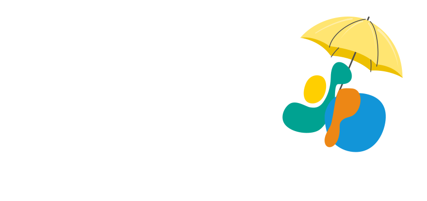

:::{div}
:class: dark:hidden

:::

:::{div}
:class: hidden dark:block

:::


Welcome to the DEMO website for the Sustainability Playbook. We're sharing this site with collaborators and potential collaborators to demonstrate our vision for the look, feel, and tone of the book.

Most pages are placeholders for now. We'll fill them in as soon as we can!

Let us know what you think! [Leave an issue](https://github.com/UC-OSPO-Network/playbook) or email us at ospo@library.ucsb.edu.

Illustrations are mostly modified from [undraw.co](https://undraw.co/), created by [Katerina Limpitsouni](https://x.com/ninalimpi).

```{warning} Disclaimer

The content provided in this playbook is for informational and educational purposes only and does not constitute legal, financial, or administrative advice. While the UC OSPO Network Project is hosted at the University of California, the views and information expressed herein are those of the project team and do not necessarily reflect the official policies, positions, or regulations of the University of California or its administration.

The descriptions of university offices (such as Sponsored Projects, Strategic Research Initiatives, etc.) and their workflows are based on the authors’ research and understanding. This content has not been officially reviewed, approved, or endorsed by the specific offices mentioned. University policies and procedures are subject to change; researchers should always consult directly with the relevant administrative offices for the most current guidance and to ensure compliance with university and funder requirements.
```